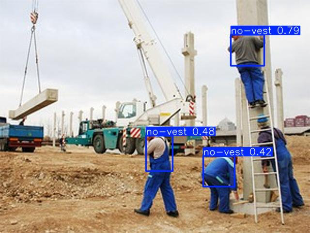
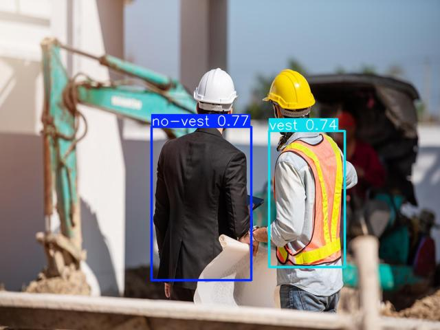
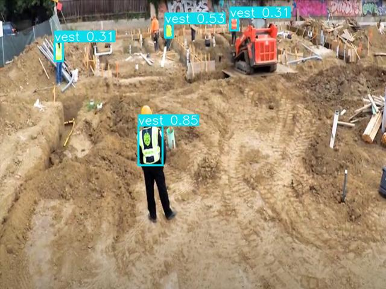

# Safety Vest Detection Model

## Overview

This project focuses on developing a deep learning model for image analysis to detect whether a person is wearing a safety vest. The model classifies images into two categories: **'vest'** and **'no-vest'**. This can be particularly useful in environments where safety compliance is crucial.

## Table of Contents

- [Background](#background)
- [Features](#features)
- [Technologies Used](#technologies-used)
- [Getting Started](#getting-started)
- [Installation](#installation)
- [Usage](#usage)
- [Predictions](#predictions)
- [License](#license)

## Background

Safety vests are essential in various industries to enhance visibility and ensure worker safety. This model aims to provide a reliable solution for automatically monitoring compliance in real-time scenarios.

## Features

- Binary classification of images into **'vest'** and **'no-vest'** categories.
- Built using **YOLOv5** for efficient object detection.
- Designed for real-world applications in safety monitoring.

## Technologies Used

- Python
- PyTorch
- Cuda
- YOLOv5
- OpenCV

## Getting Started

### Installation

1. Clone the repository:
   ```bash
   git clone https://github.com/dembA7/Deep-Learning
   ```

2. Navigate to the project directory:
   ```bash
   cd source
   ```

3. Install the required packages:
   ```bash
   pip install -r requirements.txt
   ```

### Usage

To run the model on a sample image, simply add your image to the dataset/detect/ directory and then run the source/model_detection.ipynb file.

## Predictions

Check out some real predictions of the model down below!






## License 

This project is licensed under the GNU GENERAL PUBLIC LICENSE. Read [License](./LICENSE) for details.